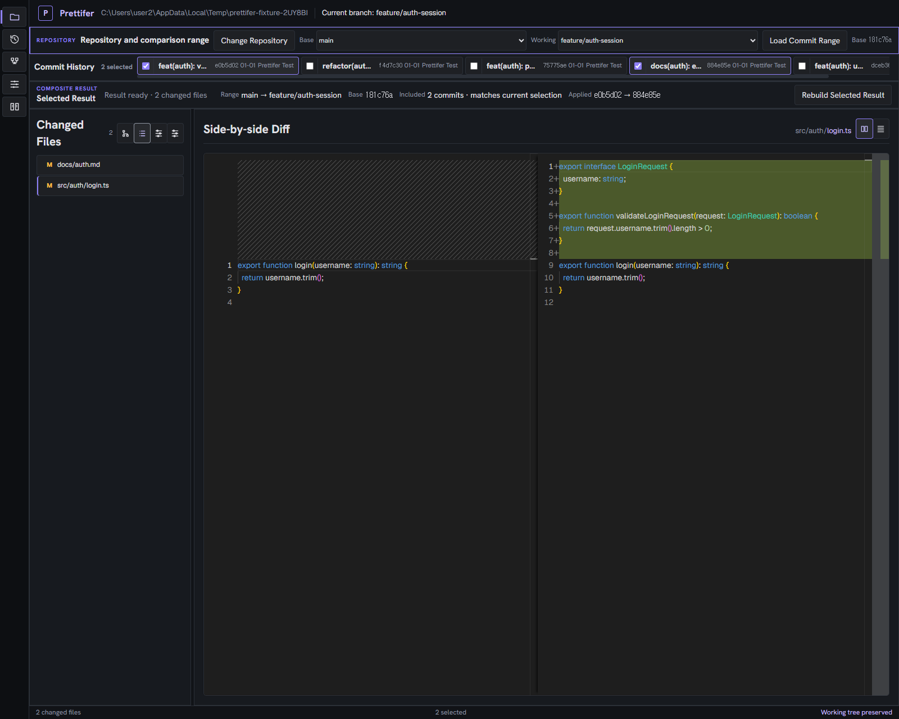

# Prettifer

Git 이력에서 서로 떨어진 커밋을 골라, 선택한 변경만 반영된 최종 파일 상태와
하나의 통합 diff를 만들어 검토하는 Windows 데스크톱 도구입니다.

이 문서는 **저장소에서 작업하는 사람과 AI 에이전트를 위한 안내**입니다.
사용자용 설치 방법과 기능 소개는
[공개 배포 저장소](https://github.com/jjj5306/prettifer-release)와
[Windows v0.1.0 릴리스](https://github.com/jjj5306/prettifer-release/releases/tag/v0.1.0)를
참고하세요.

## 시작하기 전에 읽을 문서

작업을 시작하는 에이전트는 다음 순서로 읽습니다.

| 순서 | 문서 | 내용 |
|---|---|---|
| 1 | [AGENTS.md](AGENTS.md) | 이슈 기반 작업, SDD/TDD, 코드 품질, 커밋과 PR 규칙 |
| 2 | [openspec/specs/](openspec/specs/) | **현재 구현된 동작의 기준**. 항상 진실이어야 함 |
| 3 | [openspec/changes/](openspec/changes/) | 진행 중인 변경 제안 |
| 4 | 연결된 GitHub 이슈 | 목적, 범위, 완료 기준 |

## OpenSpec 워크플로

이 저장소는 OpenSpec 기반 SDD(Spec-Driven Development)로 개발합니다. 명세가
구현의 기준이며, 코드보다 명세를 먼저 확정합니다.

### 디렉터리 구조

```text
openspec/
├─ config.yaml            스키마(spec-driven)와 프로젝트 컨텍스트, 작성 규칙
├─ specs/                 메인 스펙 - 현재 구현된 동작만 담는다
│  └─ <capability>/spec.md
└─ changes/
   ├─ <change-name>/      진행 중인 변경
   │  ├─ proposal.md      왜 / 무엇을 / 어떤 capability
   │  ├─ design.md        어떻게 / 결정과 근거 / 위험
   │  ├─ specs/<capability>/spec.md   delta spec (ADDED/MODIFIED/REMOVED/RENAMED)
   │  └─ tasks.md         검증 가능한 구현 단위
   └─ archive/YYYY-MM-DD-<change-name>/   완료되어 아카이빙된 변경
```

**메인 스펙(`openspec/specs/`)에는 실제로 구현된 동작만 둡니다.** 미구현
아이디어는 change나 GitHub 이슈에 두고, 메인 스펙에 섞지 않습니다.

### 진행 순서

```text
propose ──▶ apply ──▶ verify ──▶ sync-specs ──▶ archive
제안 작성    구현       검증        메인 스펙 반영    변경 보관
```

| 단계 | 스킬 | 하는 일 |
|---|---|---|
| propose | `/openspec-propose` | change 생성과 proposal, design, specs, tasks 작성 |
| apply | `/openspec-apply-change` | tasks를 순서대로 구현하고 체크박스 갱신 |
| verify | `/openspec-verify-change` | 완전성, 정확성, 일관성 검증 |
| sync | `/openspec-sync-specs` | delta spec을 메인 스펙에 반영 |
| archive | `/openspec-archive-change` | 완료된 change를 `changes/archive/`로 이동 |

아이디어 단계에서는 `/openspec-explore`로 먼저 정리할 수 있습니다.
커밋은 `/prettifer-commit`, PR은 `/prettifer-pr` 스킬을 사용합니다.

### 기본 규칙

- 구현 전에 proposal, specs, design, tasks를 읽습니다.
- 구현 중 요구사항이 바뀌면 OpenSpec을 함께 갱신합니다.
- 구현이 끝난 change만 아카이빙합니다. 진행 중인 change는 sync하지 않습니다.
- 명세와 구현이 다르면 방치하지 않고 요구사항을 확인한 뒤 일치시킵니다.

```powershell
npx openspec list                          # change 목록과 진행률
npx openspec status --change <name>        # 아티팩트 완료 상태
npx openspec validate --all --strict       # 전체 검증
```

## 개발 환경 퀵스타트

### 요구 사항

- Node.js `22.13+` 또는 `24+`
- Git `2.30+`
- Windows (데스크톱 앱과 Playwright Electron 검증 기준 환경)

```powershell
node --version
git --version
```

OpenSpec CLI는 `@fission-ai/openspec@1.6.0`으로 버전이 고정된 devDependency입니다.
`npm ci` 후 전역 설치 없이 `npx openspec`으로 실행합니다.

```powershell
npx --no -- openspec --version   # 1.6.0
```

`--no`는 레지스트리에서 내려받지 않겠다는 뜻입니다. npm에 `openspec`이라는 이름으로
공개된 패키지는 이 도구가 아닌 다른 빈 패키지이므로, 의존성이 빠졌을 때 조용히 엉뚱한
것을 실행하지 않고 즉시 실패하게 합니다.

### 설치와 실행

```powershell
npm ci
npm run desktop:start
```

### 고정한 개발 의존성

`package.json`의 `overrides`는 보안 권고를 해소하기 위해 전이 의존성 버전을 고정합니다.
각 항목은 상위 패키지가 안전한 범위를 선언하면 제거하는 것이 목표입니다.

| 패키지 | 고정 버전 | 이유 |
|---|---|---|
| `webpack-dev-server` | `5.2.6` | 소스 노출·CSRF·DoS 권고 6건이 `<=5.2.5`에 해당합니다. `@electron-forge/plugin-webpack@7.11.2`(최신)이 `^4.0.0`을 선언하므로 그 범위 안에는 안전한 버전이 없습니다. |
| `selfsigned` | `2.4.1` | wds 5.2.6이 선언한 `^5.5.0`을 쓰면 `pkijs` 서브트리의 `@noble/hashes` peer 충돌로 **`npm ci`가 깨집니다**(`Missing: @noble/hashes@1.4.0 from lock file`). 2.4.1은 node-forge 기반이라 그 서브트리가 사라집니다. HTTPS 개발 서버 전용 의존성이며 이 프로젝트는 그 옵션을 켜지 않습니다. |
| `dompurify`, `tar`, `tmp`, `uuid` | 고정 | 이전 권고 대응입니다. |

두 고정은 상위가 선언한 범위를 벗어나며 `selfsigned`는 다운그레이드입니다. HTTPS 개발
서버를 쓰게 되면 `selfsigned` 고정을 먼저 재검토해야 합니다. 다음 절차로 재확인합니다.

```powershell
npm audit                                  # 권고가 남아 있는지
npm ci                                     # lock과 package.json이 어긋나지 않는지
npm run desktop:start                      # 개발 서버 기동 (http://localhost:3000/main_window)
npm run test:desktop:e2e                   # 패키징 + Electron 전체 흐름
npm run desktop:make                       # 릴리스 ZIP 산출물
```

Forge가 사용하는 개발 서버 API는 생성자와 `hot`, `devMiddleware.writeToDisk`,
`historyApiFallback`, `port`, `setupExitSignals`, `static`, `headers`뿐입니다. Forge를 올릴
때 이 표면이 바뀌었는지, 그리고 `^4.0.0` 선언이 안전한 범위로 갱신되었는지 확인한 뒤
`webpack-dev-server` 고정을 제거합니다. `selfsigned` 고정은 상위의 `@noble/hashes` peer
충돌이 해소되면 제거합니다.

### 보안 권고 기준선

`npm audit`은 상위 패키지로 전파된 하나의 권고를 패키지마다 한 줄씩 세기 때문에, 권고 1건이
수십 줄로 보입니다. 그래서 숫자를 그대로 게이트로 쓰면 새로 생긴 진짜 권고가 소음에 묻힙니다.

```powershell
npm run audit:check
```

이 명령은 권고를 **구별되는 단위로 합친 뒤** `security/audit-allowlist.json`에 없는 것만
실패로 처리합니다. 두 방향으로 실패합니다.

- 목록에 **없는** 권고가 생기면 실패합니다. 고치거나, 못 고치는 이유를 적어 항목을 추가합니다.
- 목록에 있는 항목이 **더 이상 나타나지 않으면** 실패합니다. 상위에서 해결됐다는 뜻이므로
  항목을 지우라는 신호입니다.

각 항목에는 왜 못 고치는지(`reason`), 여기서 악용 가능한지(`notExploitableHere`), 무엇이
바뀌면 해소되는지(`resolvesWhen`)를 적습니다.

현재 목록에는 `brace-expansion` 권고 1건이 있습니다. 패치본 5.0.8이 기본 함수 export를 named
export로 바꿔서 `minimatch` 3.x·9.x가 `expand is not a function`으로 깨지므로 강제 고정할 수
없습니다. 이 트리의 `minimatch` 소비자 10개 중 9개가 아직 `^3.x`를 선언하며, 여기에는 eslint,
eslint-plugin-jsx-a11y, eslint-plugin-react와 `@electron/*`의 **최신 버전**이 포함됩니다.

### 검증

작업 완료 전에 다음을 모두 통과해야 합니다.

```powershell
npm test                                   # 코어·통합·renderer 테스트
npm run lint                               # ESLint
npm run typecheck                          # 프로세스 경계별 TypeScript 검사
npm run test:desktop:e2e                   # 패키징 + Playwright Electron
npx openspec validate --all --strict       # OpenSpec
npm run audit:check                        # 보안 권고 기준선
```

`npm run test:desktop:e2e`는 `electron-forge package`를 먼저 실행합니다.
Prettifer 앱이 실행 중이면 `out/desktop/prettifer-win32-x64`가 잠겨 패키징이
실패하므로 앱을 닫고 실행합니다.

### Pull Request 검사

`.github/workflows/pull-request-checks.yml`이 `main`으로 향하는 Pull Request와
`main` push에서 위 명령 중 다음을 자동으로 실행합니다.

| 검사 | 실행 명령 |
|---|---|
| Lint, types and unit tests | `npm run lint`, `npm run typecheck`, `npx --no -- openspec validate --all --strict`, `npm run audit:check`, `npm test` |
| Electron end-to-end tests | `npm run test:desktop:e2e` |

e2e가 실패하면 Playwright trace와 스크린샷이 `playwright-results` artifact로
올라가므로 로컬에서 재현하지 않고 원인을 볼 수 있습니다.

검사가 통과해도 요구사항 일치, 이슈 범위와 문서 정합성은 검증되지 않습니다. 이
항목들은 `.github/pull_request_template.md`의 자체 리뷰가 담당합니다.

### 패키지 산출물

```powershell
npm run desktop:package                    # out/desktop/prettifer-win32-x64/
npm run desktop:make                       # out/desktop/make/zip/win32/x64/
```

### 코어 라이브러리

코어만 따로 쓰려면 빌드 후 예제를 실행합니다. 공개 API와 CLI 형식은 아직
보장하지 않습니다. 자세한 입력, 결과와 오류 해결은
[코어 퀵스타트](docs/core-quickstart.md)를 참고하세요.

```powershell
npm run build:core
node .\examples\compose-selected-commits.mjs <repoPath> <baseRef> <headRef> <commit...>
```

## 코드 구조

```text
src/
├─ history/        저장소 이력과 비교 범위 조회
├─ composition/    통합 결과 계산 (격리된 임시 clone, 선택 적용, Git 객체 결과 수집)
├─ git/            Git 실행 경계
└─ desktop/
   ├─ main/        Electron main - Git, 파일 시스템, 결과 계산
   ├─ preload/     typed API만 노출
   ├─ shared/      main과 renderer가 공유하는 계약
   └─ renderer/    React UI (기능별 폴더에 컴포넌트/상태/스타일/테스트)
```

프로세스 경계는 ESLint `no-restricted-imports`와 프로세스별 TypeScript 설정으로
강제합니다. renderer는 Node.js와 Electron 모듈을 직접 쓰지 않고 preload가 공개한
typed API만 호출합니다.

## 화면 기준

데스크톱 앱은 graphite 계열 어두운 배경과 보라색 강조색을 사용하고 화면 문구는
영어로 제공합니다. 아래 목업은 색상과 시각 밀도의 기준입니다.

| Tree View | List View |
|---|---|
|  |  |

## 현재 지원 범위

메인 스펙에 기록된 동작이 기준입니다. 아직 구현하지 않은 항목은 GitHub 이슈로
관리합니다.

**지원함**

- 하나의 조상 관계로 정렬할 수 있는 선형 이력에서 비연속 커밋 선택
- 같은 파일을 여러 번 변경한 선택의 최종 상태 합성
- 텍스트 파일의 추가, 수정, 삭제와 바이너리 파일 식별
- 선택 변경 시 최신 계산 결과 게시와 이전 계산 취소
- 계산 중 사용자 branch, HEAD, staged/unstaged/untracked와 Git 메타데이터 보존
- merge commit을 기준 부모와 함께 선택해 결과에 포함
- 적용할 수 없는 파일만 문제로 표시하는 부분 결과 (나머지 파일은 정상 검토)

**아직 지원하지 않음**

- 변경 파일 그룹화 · 파일별 커밋 흐름 · 커밋별 변경 파일 탐색
- 조상 관계 없는 커밋의 적용 순서 확인
- 전체 Git 그래프와 불완전 이력 진단
- rename 추론, 루트 커밋 비교
- 공개 CLI, 설치 프로그램, 코드 서명, 자동 업데이트
