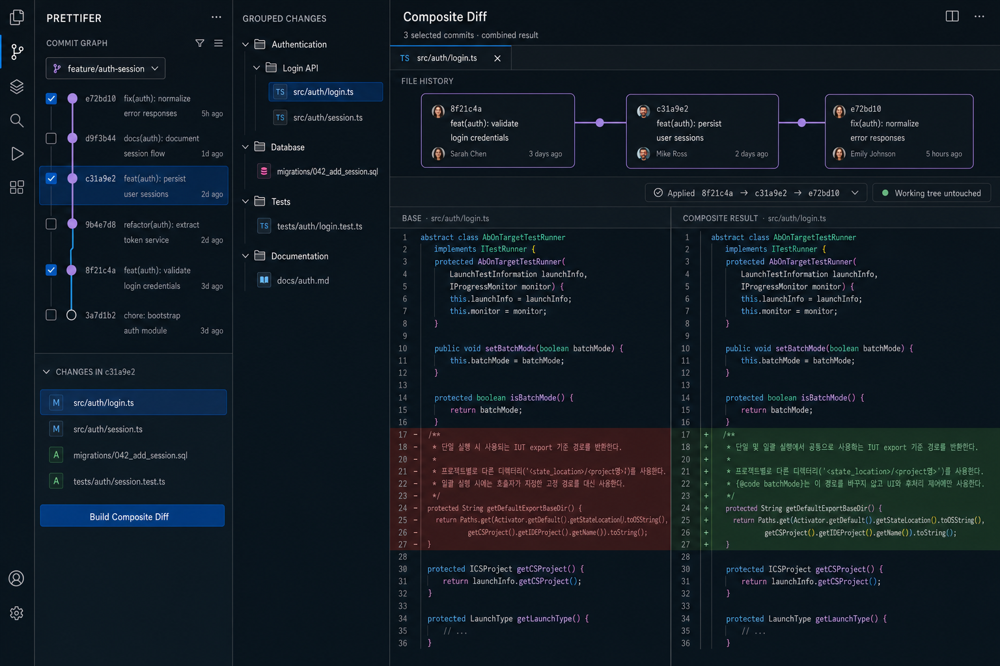

# Prettifer
Config-driven Git diff views for humans and AI agents.

## Initial UX Mockup

The following mockup captures the initial product direction: select commits
from a Git graph, inspect the files changed by a commit, group the combined
changes, and review the final result in a side-by-side diff.

This is a concept mockup. Visual details may change as the specification is
refined.

